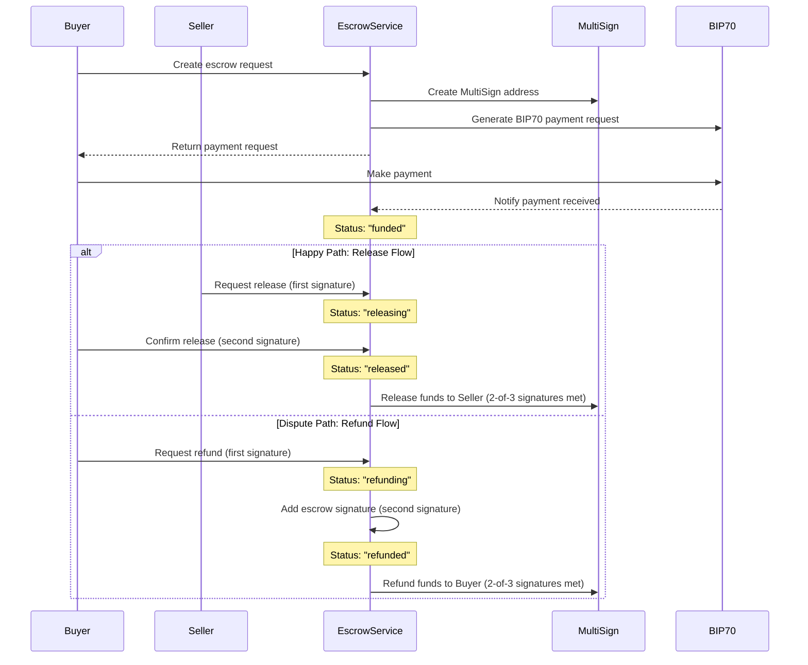

# Escrow Service with BIP70 and MultiSign

This repository contains a full implementation of a Bitcoin escrow service using BIP70 payment protocol and MultiSign addresses, implemented in Golang.

## Introduction

An escrow service acts as a neutral third party to hold funds during a transaction between two parties, ensuring that the payment is only released when both parties fulfill their obligations. This service uses Bitcoin's BIP70 payment protocol for payment requests and MultiSign (2-of-3) addresses for enhanced security, requiring at least two signatures (from buyer, seller, or escrow service) to release funds.

## Features

- Create 2-of-3 MultiSign addresses for escrow transactions
- Generate BIP70 payment requests with customizable parameters
- Verify Bitcoin payments to escrow addresses
- Multi-signature release flow requiring 2 of 3 signatures
- Multi-signature refund flow requiring 2 of 3 signatures
- Tracking of signatures from each party (buyer, seller, escrow)
- Intermediate states for partial signature collection
- In-memory transaction storage (for demo purposes)
- RESTful API with JSON responses

## Sequence Diagram



## Setup

### Prerequisites

- Go 1.16 or later
- Git

### Clone the repository

```sh
git clone https://github.com/cqhung1412/bip70-multisign-demo.git
cd bip70-multisign-demo
```

### Install dependencies

```sh
go mod tidy
```

## Running the Application

### Starting the server

```sh
go run main.go
```

By default, the server will start on port 8080. You can specify a different port using the `PORT` environment variable:

```sh
PORT=9000 go run main.go
```

### Building the application

```sh
go build -o escrow-service
```

Then run the executable:

```sh
./escrow-service
```

## API Documentation

### Endpoints

| Endpoint | Method | Description |
|----------|--------|-------------|
| `/api/escrow/create` | POST | Create a new escrow transaction |
| `/api/escrow/release` | POST | Release funds from escrow to seller |
| `/api/escrow/refund` | POST | Refund funds from escrow to buyer |
| `/api/escrow/verify-payment` | POST | Verify a payment to an escrow |
| `/api/escrow/get` | GET | Get escrow details by ID |
| `/api/pay/request/{requestID}` | GET | Get a BIP70 payment request |
| `/api/pay/{requestID}` | POST | Submit a BIP70 payment |
| `/health` | GET | Health check endpoint |
| `/` | GET | API information |

## Step-by-Step Guide

Firstly, you need to get the public/private key pairs for the buyer, seller, and the escrow service. You can get these keys from [privatekeys.pw](https://privatekeys.pw/keys/bitcoin-testnet). You can also click `Random` for random keys.

### Creating an Escrow

**Request:**

```sh
curl -X POST http://localhost:8080/api/escrow/create \
  -H "Content-Type: application/json" \
  -d '{
    "buyer_pubkey": "03cd082c25b7f12eed9fba3295c1824148a72440894b42ddca7a73243c9d028f4a",
    "seller_pubkey": "03d70c8915a02010d575a9ae39f7689830822780a606cb6faa4b1d4dbd277240b6",
    "escrow_pubkey": "02a8bee3df56e1362c4db0154b4884a06edcc72e1d421b7c56c694a2df9d8ee867",
    "amount": 100000,
    "description": "Payment for product ABC"
  }' | jq
```

After running this command, you'll receive a response that includes both:

- An `escrow_id` (e.g., "escrow-1741623230106929015")
- A payment request that contains a `request_id` (e.g., "req-1741623230106850415")

Save these IDs for the next steps.

**Response:**

```json
{
  "id": "escrow-1741623230106929015",
  "buyer_pubkey": "03cd082c25b7f12eed9fba3295c1824148a72440894b42ddca7a73243c9d028f4a",
  "seller_pubkey": "03d70c8915a02010d575a9ae39f7689830822780a606cb6faa4b1d4dbd277240b6",
  "escrow_pubkey": "02a8bee3df56e1362c4db0154b4884a06edcc72e1d421b7c56c694a2df9d8ee867",
  "multisig_address": "2N7DRF4Ny72Ws7p2TwQbd8J7oK4RHiFuLhX",
  "amount": 100000,
  "description": "Payment for product ABC",
  "status": "created",
  "payment_request": {
    "payment_details_version": 1,
    "pki_type": "none",
    "pki_data": null,
    "serialized_details": "eyJuZXR3b3JrIjoidGVzdCIsIm91dHB1dHMiOlt7ImFtb3VudCI6MTAwMDAwLCJzY3JpcHQiOiJxUlNaT2xMMEJjNG00b2xVY0YxeDZ3RTZaZy90V29jPSJ9XSwidGltZSI6MTc0MTYyMzIzMCwiZXhwaXJlcyI6MTc0MTYyNjgzMCwibWVtbyI6IkVzY3JvdyBwYXltZW50IiwicGF5bWVudF91cmwiOiJodHRwOi8vbG9jYWxob3N0OjgwODAvYXBpL3BheS9yZXEtMTc0MTYyMzIzMDEwNjg1MDQxNSIsIm1lcmNoYW50X2RhdGEiOiJleUp2Y21SbGNsOXBaQ0k2SUNKeVpYRXRNVGMwTVRZeU16SXpNREV3TmpnMU1EUXhOU0o5In0=",
    "signature": null,
    "address": "2N7DRF4Ny72Ws7p2TwQbd8J7oK4RHiFuLhX",
    "amount": 100000,
    "expires_time": "2025-03-11T00:13:50.106852415+07:00",
    "merchant_id": "EscrowService",
    "request_id": "req-1741623230106850415",
    "callback_url": "http://localhost:8080/api/callback/req-1741623230106850415"
  },
  "created_at": "2025-03-10T23:13:50.106929615+07:00",
  "expires_at": "2025-03-11T23:13:50.106928915+07:00"
}
```

### Retrieve the Payment Request

Use the `request_id` from step 1 to get the payment request details:

**Request:**

```sh
curl -X GET http://localhost:8080/api/pay/request/req-1741623230106850415 | jq
```

**Response:**

```json
{
  "payment_details_version": 1,
  "pki_type": "none",
  "pki_data": null,
  "serialized_details": "base64-encoded-data-here",
  "signature": null,
  "address": "tb1qw508d6qejxtdg4y5r3zarvary0c5xw7kxpjzsx",
  "amount": 100000,
  "expires_time": "2025-03-11T00:14:32.131267886+07:00",
  "merchant_id": "EscrowService",
  "request_id": "req-1741623230106850415",
  "callback_url": "http://localhost:8080/api/callback/req-1741623230106850415"
}
```

This returns a BIP70 payment request with content type `application/bitcoin-paymentrequest`, containing all details needed to make a payment.

Example test response:

```sh
curl -s -I -X GET http://localhost:8080/api/pay/request/req-1741623230106850415 | grep -i "^Content-Type:"

Content-Type: application/bitcoin-paymentrequest
```

### Submit a Payment

After sending Bitcoin to the provided address, submit the payment details:

**Request:**

```sh
curl -X POST http://localhost:8080/api/pay/req-1741623230106850415 \
  -H "Content-Type: application/bitcoin-payment" \
  -d '{
    "merchant_data": "eyJvcmRlcl9pZCI6InJlcS0xNzQxNjIzMjMwMTA2ODUwNDE1In0=",
    "transactions": ["26dd4663518b3e24872fd5635fd889a8a0e1c232b8d488868ac378a0a2d28fb2"],
    "refund_to": [],
    "memo": "Payment for escrow #escrow-1741623230106929015"
  }' | jq
```

**Response:**

```json
{
  "payment": {
    "merchant_data": "eyJvcmRlcl9pZCI6InJlcS0xNzQxNjIzMjMwMTA2ODUwNDE1In0=",
    "transactions": [
      "26dd4663518b3e24872fd5635fd889a8a0e1c232b8d488868ac378a0a2d28fb1"
    ],
    "refund_to": [],
    "memo": "Payment for escrow #escrow-1741623230106929015"
  },
  "memo": "Thank you for your payment"
}
```

**Explanation of the fields:**

- `merchant_data`: Base64-encoded data that was originally sent by the merchant in the payment request. In this example, it's just encoding the request ID (e.g., `{"order_id":"req-1741623230106850415"}`).
- `transactions`: An array containing one or more Bitcoin transactions in base64-encoded format. For this demo, we're using a placeholder transaction.
- `refund_to`: An empty array since we're not specifying refund addresses.
- `memo`: Optional message about the payment.

In a real-world scenario, your Bitcoin wallet would generate the actual transaction data.

The response will be a payment acknowledgment with content type `application/bitcoin-paymentack`, confirming that your payment was received.

Example response:

```sh
curl -s -D - http://localhost:8080/api/pay/req-1741623230106850415 \
  -H "Content-Type: application/bitcoin-payment" \
  -d '{
    "merchant_data": "eyJvcmRlcl9pZCI6InJlcS0xNzQxNjIzMjMwMTA2ODUwNDE1In0=",
    "transactions": ["26dd4663518b3e24872fd5635fd889a8a0e1c232b8d488868ac378a0a2d28fb1"],
    "refund_to": [],
    "memo": "Payment for escrow #escrow-1741623230106929015"
  }' | grep -i "^Content-Type:"

Content-Type: application/bitcoin-paymentack
```

### Verify the Payment

Now verify that the payment was processed using the escrow ID:

**Request:**

```sh
curl -X POST http://localhost:8080/api/escrow/verify-payment \
  -H "Content-Type: application/json" \
  -d '{
    "escrow_id": "escrow-1741623230106929015",
    "txid": "26dd4663518b3e24872fd5635fd889a8a0e1c232b8d488868ac378a0a2d28fb1"
  }'
```

**Response:**

```json
{
  "amount":100000,
  "buyer_pubkey":"03cd082c25b7f12eed9fba3295c1824148a72440894b42ddca7a73243c9d028f4a",
  "created_at":"2025-03-10T23:13:50.106929615+07:00",
  "escrow_id":"escrow-1741623230106929015",
  "escrow_pubkey":"02a8bee3df56e1362c4db0154b4884a06edcc72e1d421b7c56c694a2df9d8ee867",
  "expires_at":"2025-03-11T23:13:50.106928915+07:00",
  "multisig_address":"2N7DRF4Ny72Ws7p2TwQbd8J7oK4RHiFuLhX",
  "payment_txid":"26dd4663518b3e24872fd5635fd889a8a0e1c232b8d488868ac378a0a2d28fb1",
  "seller_pubkey":"03d70c8915a02010d575a9ae39f7689830822780a606cb6faa4b1d4dbd277240b6",
  "status":"funded"
}
```


The `txid` is the transaction ID from the Bitcoin transaction you submitted in step 3. For testing purposes, the following transaction IDs are pre-validated in the system:

1. `26dd4663518b3e24872fd5635fd889a8a0e1c232b8d488868ac378a0a2d28fb1`
2. `3a4b5c6d7e8f9a0b1c2d3e4f5a6b7c8d9e0f1a2b3c4d5e6f7a8b9c0d1e2f3a4b`

Using any other transaction ID will result in a verification error, as the system performs basic validation. The verification checks:

1. That the transaction ID is in the correct format (64 hexadecimal characters)
2. That the transaction exists in the "blockchain" (simulated with a list of known transactions)
3. That the escrow hasn't already been funded

In a real implementation, this would connect to a Bitcoin node to verify the transaction exists, has sufficient confirmations, and pays to the correct address.

### Release Funds

**Request:**

```sh
curl -X POST http://localhost:8080/api/escrow/release \
  -H "Content-Type: application/json" \
  -d '{
    "escrow_id": "escrow-1741623230106929015",
    "private_key": "private-key-here",
    "signature": "signature-here",
    "party": "seller",
    "public_key": "03d70c8915a02010d575a9ae39f7689830822780a606cb6faa4b1d4dbd277240b6"
  }'
```

**Response (First Signature):**

```json
{
  "escrow_id": "escrow-1741623230106929015",
  "status": "releasing",
  "signatures_count": 1,
  "signatures_needed": 2,
  "signatures": [
    {
      "party": "seller",
      "signature": "signature-here",
      "timestamp": "2025-03-11T23:15:50.106945915+07:00",
      "public_key": "03d70c8915a02010d575a9ae39f7689830822780a606cb6faa4b1d4dbd277240b6"
    }
  ]
}
```

**Response (After Second Signature):**

```json
{
  "escrow_id": "escrow-1741623230106929015",
  "status": "released",
  "txid": "release-transaction-id",
  "signatures_count": 2,
  "signatures_needed": 2,
  "signatures": [
    {
      "party": "seller",
      "signature": "signature-here",
      "timestamp": "2025-03-11T23:15:50.106945915+07:00",
      "public_key": "03d70c8915a02010d575a9ae39f7689830822780a606cb6faa4b1d4dbd277240b6"
    },
    {
      "party": "buyer",
      "signature": "second-signature-here",
      "timestamp": "2025-03-11T23:16:50.101836915+07:00",
      "public_key": "03cd082c25b7f12eed9fba3295c1824148a72440894b42ddca7a73243c9d028f4a"
    }
  ]
}
```

### Refunding Funds

This uses a different escrow ID and request ID from the previous example.

**Request:**

```sh
curl -X POST http://localhost:8080/api/escrow/refund \
  -H "Content-Type: application/json" \
  -d '{
    "escrow_id": "escrow-1637142574328",
    "private_key": "private-key-here",
    "signature": "signature-here",
    "party": "buyer",
    "public_key": "03cd082c25b7f12eed9fba3295c1824148a72440894b42ddca7a73243c9d028f4a"
  }'
```

**Response (First Signature):**

```json
{
  "escrow_id": "escrow-1637142574328",
  "status": "refunding",
  "signatures_count": 1,
  "signatures_needed": 2,
  "signatures": [
    {
      "party": "buyer",
      "signature": "signature-here",
      "timestamp": "2023-11-17T13:05:10Z",
      "public_key": "03cd082c25b7f12eed9fba3295c1824148a72440894b42ddca7a73243c9d028f4a"
    }
  ]
}
```

**Response (After Second Signature):**

```json
{
  "escrow_id": "escrow-1637142574328",
  "status": "refunded",
  "txid": "refund-transaction-id",
  "signatures_count": 2,
  "signatures_needed": 2,
  "signatures": [
    {
      "party": "buyer",
      "signature": "signature-here",
      "timestamp": "2023-11-17T13:05:10Z",
      "public_key": "03cd082c25b7f12eed9fba3295c1824148a72440894b42ddca7a73243c9d028f4a"
    },
    {
      "party": "escrow",
      "signature": "escrow-signature-here",
      "timestamp": "2023-11-17T13:10:22Z",
      "public_key": "02a8bee3df56e1362c4db0154b4884a06edcc72e1d421b7c56c694a2df9d8ee867"
    }
  ]
}
```

### Getting Escrow Details

**Request:**

```sh
curl -X GET http://localhost:8080/api/escrow/get?id=escrow-1741623230106929015 | jq
```

**Response:**

```json
{
  "amount": 100000,
  "buyer_pubkey": "03cd082c25b7f12eed9fba3295c1824148a72440894b42ddca7a73243c9d028f4a",
  "created_at": "2025-03-10T23:13:50.106929615+07:00",
  "description": "Payment for product ABC",
  "escrow_id": "escrow-1741623230106929015",
  "escrow_pubkey": "02a8bee3df56e1362c4db0154b4884a06edcc72e1d421b7c56c694a2df9d8ee867",
  "expires_at": "2025-03-11T23:13:50.106928915+07:00",
  "multisig_address": "2N7DRF4Ny72Ws7p2TwQbd8J7oK4RHiFuLhX",
  "payment_request": {
    "payment_details_version": 1,
    "pki_type": "none",
    "pki_data": null,
    "serialized_details": "eyJuZXR3b3JrIjoidGVzdCIsIm91dHB1dHMiOlt7ImFtb3VudCI6MTAwMDAwLCJzY3JpcHQiOiJxUlNaT2xMMEJjNG00b2xVY0YxeDZ3RTZaZy90V29jPSJ9XSwidGltZSI6MTc0MTYyMzIzMCwiZXhwaXJlcyI6MTc0MTYyNjgzMCwibWVtbyI6IkVzY3JvdyBwYXltZW50IiwicGF5bWVudF91cmwiOiJodHRwOi8vbG9jYWxob3N0OjgwODAvYXBpL3BheS9yZXEtMTc0MTYyMzIzMDEwNjg1MDQxNSIsIm1lcmNoYW50X2RhdGEiOiJleUp2Y21SbGNsOXBaQ0k2SUNKeVpYRXRNVGMwTVRZeU16SXpNREV3TmpnMU1EUXhOU0o5In0=",
    "signature": null,
    "address": "2N7DRF4Ny72Ws7p2TwQbd8J7oK4RHiFuLhX",
    "amount": 100000,
    "expires_time": "2025-03-11T00:13:50.106852415+07:00",
    "merchant_id": "EscrowService",
    "request_id": "req-1741623230106850415",
    "callback_url": "http://localhost:8080/api/callback/req-1741623230106850415"
  },
  "payment_txid": "26dd4663518b3e24872fd5635fd889a8a0e1c232b8d488868ac378a0a2d28fb1",
  "release_parties": [
    "seller",
    "escrow"
  ],
  "release_signatures": [
    {
      "party": "seller",
      "signature": "signature-seller",
      "timestamp": "2025-03-10T23:30:35.802372786+07:00",
      "public_key": "03d70c8915a02010d575a9ae39f7689830822780a606cb6faa4b1d4dbd277240b6"
    },
    {
      "party": "escrow",
      "signature": "signature-escrow",
      "timestamp": "2025-03-10T23:31:18.55613582+07:00",
      "public_key": "02a8bee3df56e1362c4db0154b4884a06edcc72e1d421b7c56c694a2df9d8ee867"
    }
  ],
  "release_signatures_count": 2,
  "release_txid": "tx-1741624278556137820",
  "seller_pubkey": "03d70c8915a02010d575a9ae39f7689830822780a606cb6faa4b1d4dbd277240b6",
  "status": "released"
}
```

## Testing

### Manual Testing

You can use the provided curl commands above to test the API endpoints.
<!-- 
### Automated Testing

To run the test suite:

```sh
go test ./...
```

To run tests with coverage:

```sh
go test ./... -cover
```

To run a specific test:

```sh
go test ./escrow -run TestCreateEscrow
``` -->

## BIP70 Payment Protocol

### Overview

This implementation includes a simplified version of the BIP70 Payment Protocol, which enables secure, reliable, and user-friendly Bitcoin transactions between customers and merchants. BIP70 provides several advantages over traditional Bitcoin payments:

1. **Human-readable payment details**: Customers can see who they're paying and what they're paying for
2. **Security via X.509 certificates**: Customers can verify the merchant's identity (simplified in this demo)
3. **Refund addresses**: The customer can provide a refund address in case a refund is needed
4. **Payment acknowledgments**: The merchant can acknowledge receipt of payment
5. **Improved user experience**: Wallets can display better information about the payment

### BIP70 Message Flow

1. **PaymentRequest**: Merchant → Customer
   - Contains payment details (amount, address, memo, expiry)
   - Signed by the merchant (simplified in this demo)

2. **Payment**: Customer → Merchant
   - Contains the signed Bitcoin transaction
   - May include refund addresses

3. **PaymentACK**: Merchant → Customer
   - Acknowledges receipt of the payment
   - May include a memo from the merchant

### Payment Request Example

Please follow the steps in the [Step-by-Step Guide](#step-by-step-guide) to create an escrow and retrieve the payment request.

## Implementation Notes

- This is a demo implementation, using simplified versions of BIP70 and MultiSign.
- The escrow flow supports the following status transitions:
  - `created` → `funded` → `releasing` → `released`
  - `created` → `funded` → `refunding` → `refunded`
- Multi-signature validation requires 2 of 3 signatures (buyer, seller, escrow) to release or refund funds
- Each party can sign only once for each operation (release or refund)
- **BIP70 Implementation Details**:
  - Uses JSON serialization instead of protobuf for simplicity
  - Skips X.509 certificate validation for simplicity
  - Includes the core message structure: PaymentRequest, Payment, PaymentACK
  - Supports the appropriate MIME types for each message
  - Implements the basic payment flow
  - **Optional Fields in Payment Message**:
    - `refund_to`: This field lets you specify where refunds should be sent if needed. Each item in this array contains:
    - `amount`: Amount in satoshis that can be refunded to this output
    - `script`: The Bitcoin script that defines how the refund can be claimed (usually a P2PKH or P2SH script)
- In most wallet implementations, this field is handled automatically and you don't need to specify it manually
- In a production environment, you would need to:
  - Connect to a Bitcoin node for transaction validation
  - Implement proper key management and security
  - Use a persistent database instead of in-memory storage
  - Add proper authentication and authorization
  - Use protobuf serialization for BIP70 messages
  - Implement X.509 certificate signing and validation
  - Handle transaction fees properly
  - Add actual signature validation against public keys
