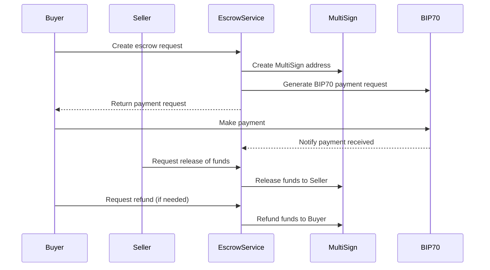

# Escrow Service with BIP70 and MultiSign

This repository contains a full implementation of a Bitcoin escrow service using BIP70 payment protocol and MultiSign addresses, implemented in Golang.

## Introduction

An escrow service acts as a neutral third party to hold funds during a transaction between two parties, ensuring that the payment is only released when both parties fulfill their obligations. This service uses Bitcoin's BIP70 payment protocol for payment requests and MultiSign (2-of-3) addresses for enhanced security, requiring at least two signatures (from buyer, seller, or escrow service) to release funds.

## Features

- Create 2-of-3 MultiSign addresses for escrow transactions
- Generate BIP70 payment requests with customizable parameters
- Verify Bitcoin payments to escrow addresses
- Release funds from escrow to the seller
- Refund funds to the buyer if needed
- In-memory transaction storage (for demo purposes)
- RESTful API with JSON responses

## Sequence Diagram



## Setup

### Prerequisites

- Go 1.16 or later
- Git

### Clone the repository

```sh
git clone https://github.com/cqhung1412/bip70-multisign-demo.git
cd bip70-multisign-demo
```

### Install dependencies

```sh
go mod tidy
```

## Running the Application

### Starting the server

```sh
go run main.go
```

By default, the server will start on port 8080. You can specify a different port using the `PORT` environment variable:

```sh
PORT=9000 go run main.go
```

### Building the application

```sh
go build -o escrow-service
```

Then run the executable:

```sh
./escrow-service
```

## API Documentation

### Endpoints

| Endpoint | Method | Description |
|----------|--------|-------------|
| `/api/escrow/create` | POST | Create a new escrow transaction |
| `/api/escrow/release` | POST | Release funds from escrow to seller |
| `/api/escrow/refund` | POST | Refund funds from escrow to buyer |
| `/api/escrow/verify-payment` | POST | Verify a payment to an escrow |
| `/api/escrow/get` | GET | Get escrow details by ID |
| `/health` | GET | Health check endpoint |
| `/` | GET | API information |

### Creating an Escrow

**Request:**

```sh
curl -X POST http://localhost:8080/api/escrow/create \
  -H "Content-Type: application/json" \
  -d '{
    "buyer_pubkey": "0280a01dd11fb2e2c4a55a6555c68b1f51242b6901e8d19696b06d2fa8de9760ad",
    "seller_pubkey": "03ad8e7eb4f3a7fbf9ab03c58d92ade33bacb5a318e73169c3f397f4b5052115c7",
    "escrow_pubkey": "02b4632d08485ff1df2db55b9dafd23347d1c47a457072a1e87be26896549a8737",
    "amount": 100000,
    "description": "Payment for product XYZ"
  }'
```

**Response:**

```json
{
  "id": "escrow-1637142574328",
  "buyer_pubkey": "0280a01dd11fb2e2c4a55a6555c68b1f51242b6901e8d19696b06d2fa8de9760ad",
  "seller_pubkey": "03ad8e7eb4f3a7fbf9ab03c58d92ade33bacb5a318e73169c3f397f4b5052115c7",
  "escrow_pubkey": "02b4632d08485ff1df2db55b9dafd23347d1c47a457072a1e87be26896549a8737",
  "multisig_address": "2NCEMwNagVAbbH9oKsNg1GgEcQm6xnKuhCZ",
  "amount": 100000,
  "description": "Payment for product XYZ",
  "status": "created",
  "payment_request": {
    "address": "2NCEMwNagVAbbH9oKsNg1GgEcQm6xnKuhCZ",
    "amount": 100000,
    "memo": "Escrow payment",
    "expires": "2023-11-17T12:49:34Z",
    "payment_url": "http://localhost:8080/pay/req-1637142574328",
    "merchant_id": "EscrowService",
    "request_id": "req-1637142574328",
    "callback_url": "http://localhost:8080/callback/req-1637142574328"
  },
  "created_at": "2023-11-17T11:49:34Z",
  "expires_at": "2023-11-18T11:49:34Z"
}
```

### Verifying Payment

**Request:**

```sh
curl -X POST http://localhost:8080/api/escrow/verify-payment \
  -H "Content-Type: application/json" \
  -d '{
    "escrow_id": "escrow-1637142574328",
    "txid": "abc123def456"
  }'
```

### Releasing Funds

**Request:**

```sh
curl -X POST http://localhost:8080/api/escrow/release \
  -H "Content-Type: application/json" \
  -d '{
    "escrow_id": "escrow-1637142574328",
    "private_key": "private-key-here",
    "signature": "signature-here"
  }'
```

### Refunding Funds

**Request:**

```sh
curl -X POST http://localhost:8080/api/escrow/refund \
  -H "Content-Type: application/json" \
  -d '{
    "escrow_id": "escrow-1637142574328",
    "private_key": "private-key-here",
    "signature": "signature-here"
  }'
```

### Getting Escrow Details

**Request:**

```sh
curl -X GET http://localhost:8080/api/escrow/get?id=escrow-1637142574328 | jq
```

## Testing

### Manual Testing

You can use the provided curl commands above to test the API endpoints.

### Automated Testing

To run the test suite:

```sh
go test ./...
```

To run tests with coverage:

```sh
go test ./... -cover
```

To run a specific test:

```sh
go test ./escrow -run TestCreateEscrow
```

## Implementation Notes

- This is a demo implementation, using simplified versions of BIP70 and MultiSign.
- In a production environment, you would need to:
  - Connect to a Bitcoin node for transaction validation
  - Implement proper key management and security
  - Use a persistent database instead of in-memory storage
  - Add proper authentication and authorization
  - Implement complete BIP70 protocol including payment ACKs
  - Handle transaction fees properly

## Contributing

Contributions are welcome! Please feel free to submit a Pull Request.

## License

This project is licensed under the MIT License.