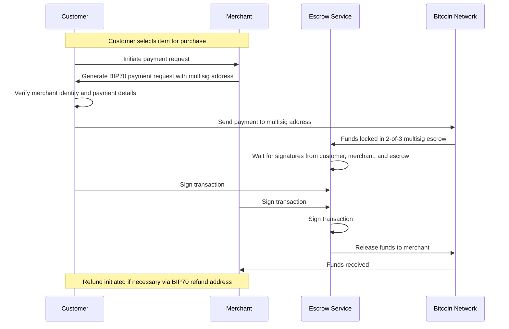
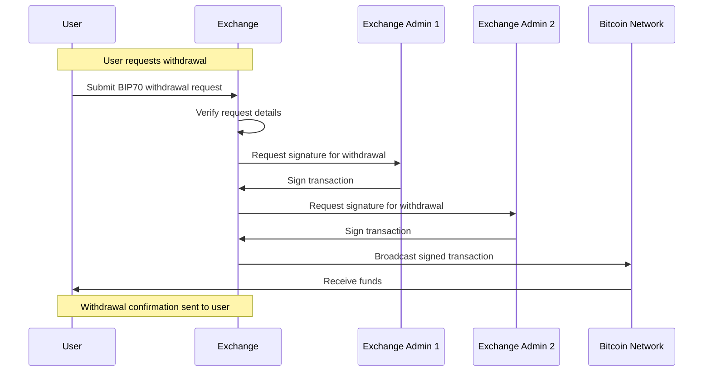
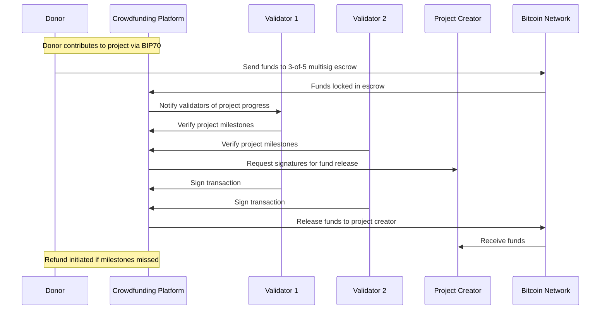
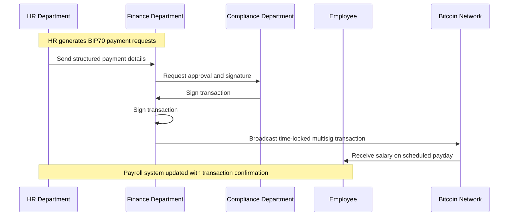

## Application 1: Secure E-Commerce Payments for High-Value Transactions

## Application 2: Cryptocurrency Exchange Cold Storage with BIP70 Withdrawals

## Application 3: Decentralized Crowdfunding Escrow with Refund Mechanism

## Application 4: Institutional Payroll Management with Time-Locked Multisig Transactions

