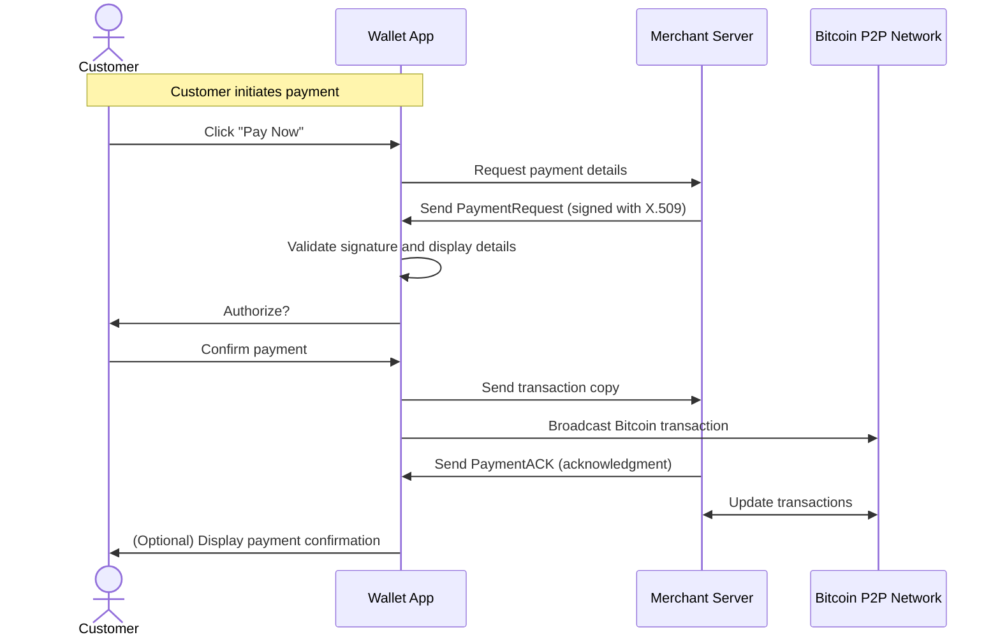

```mermaid
sequenceDiagram
    actor Customer as Customer
    participant Wallet as Wallet App
    participant Merchant as Merchant Server
    participant Network as Bitcoin P2P Network

    Note over Customer,Wallet: Customer initiates payment
    Customer->>Wallet: Click "Pay Now"
    Wallet->>Merchant: Request payment details
    Merchant->>Wallet: Send PaymentRequest (signed with X.509)
    Wallet->>Wallet: Validate signature and display details
    Wallet->>Customer: Authorize?
    Customer->>Wallet: Confirm payment
    Wallet->>Merchant: Send transaction copy
    Wallet->>Network: Broadcast Bitcoin transaction
    Merchant->>Wallet: Send PaymentACK (acknowledgment)
    Merchant<<->>Network: Update transactions
    Wallet->>Customer: (Optional) Display payment confirmation
```
