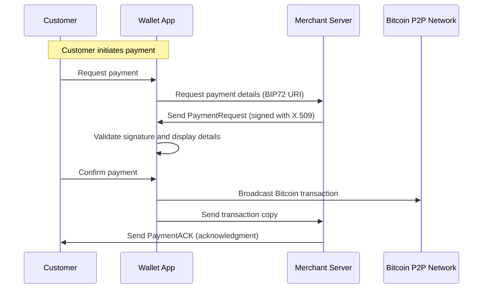

```mermaid
sequenceDiagram
    participant Customer as Customer
    participant Wallet as Wallet App
    participant Merchant as Merchant Server
    participant Network as Bitcoin P2P Network

    Note over Customer,Wallet: Customer initiates payment
    Customer->>Wallet: Request payment
    Wallet->>Merchant: Request payment details (BIP72 URI)
    Merchant->>Wallet: Send PaymentRequest (signed with X.509)
    Wallet->>Wallet: Validate signature and display details
    Customer->>Wallet: Confirm payment
    Wallet->>Network: Broadcast Bitcoin transaction
    Wallet->>Merchant: Send transaction copy
    Merchant->>Customer: Send PaymentACK (acknowledgment)
```
