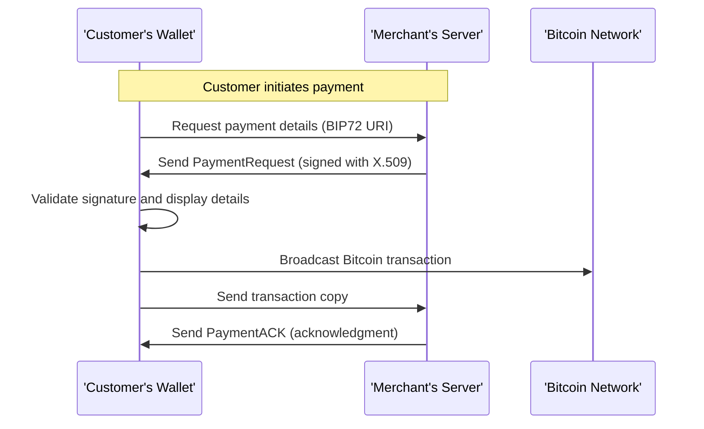

```mermaid
sequenceDiagram
    participant Customer as 'Customer's Wallet'
    participant Merchant as 'Merchant's Server'
    participant Network as 'Bitcoin Network'

    Note over Customer,Merchant: Customer initiates payment
    Customer->>Merchant: Request payment details (BIP72 URI)
    Merchant->>Customer: Send PaymentRequest (signed with X.509)
    Customer->>Customer: Validate signature and display details
    Customer->>Network: Broadcast Bitcoin transaction
    Customer->>Merchant: Send transaction copy
    Merchant->>Customer: Send PaymentACK (acknowledgment)
```
